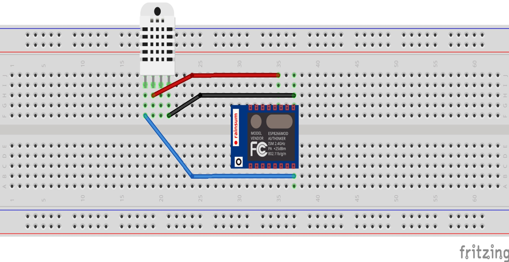
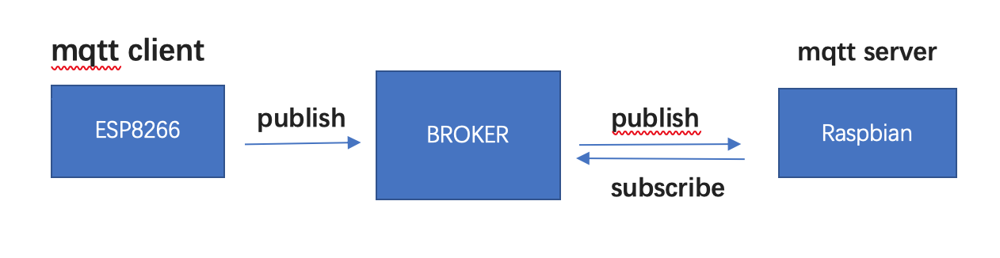

# ESP8266-MQTT-RaspberryPi
Use ESP8266MOD AI-THINKER as client sending data collected by DHT22 sensor to Raspberry pi.
And use Python Flask to dynamically display the received data in a web page.

P.S: I did this project in 2017 summer. The code was almost lost now. If I have time, I will do it again and try to upload it.

## To do this you will need:
* Raspberry Pi desktop setup
* One DHT22 sensor
* Some jumper
* Breadboard

## The process is below:
1.	Wire esp8266 with DHT22 sensor on breadboard
2.	Configure Raspbian
3.	Run server program on Raspbian
4.	Upload scratch to esp8266 using Arduino IDE
5.	Raspbian receive message from esp8266

## STEP 1: Connect a DHT22 sensor to ESP8266
In this section, use the breadboard and jumper wires to make the connection as follows.

For sensor pins, use following wiring:

| Sensor | ESP8266 | Cable |
| ------ | ------- | ----- |
| VCC(3.3-5v) | VCC(3V) | Blue |
| DATA | GPIO 2 | Red |
| GND | GND | Black |

## STEP 2: Configure and set up Raspberry pi
To configure the server environment:
First, open the terminal and type

	<b>sudo apt-get update</b>

Next, we will need to install a framework called Flask and two packages called flask-socketio and flask-bootstrap to create a website for displaying the data.\

	<b>sudo pip install Flask</b>  
	<b>sudo pip install flask-socketio</b> 
	<b>sudo pip install flask-bootstrap</b> 

To communicate with esp8266, we still need another Flask extension called Flask-MQTT. (MQTT is a machine-to-machine "Internet of Things" protocol and was designed for extremely lightweight publish/subscribe messaging transport.) Simply install the package as usual via pip:

	<b>sudo pip install flask-mqtt</b>

## STEP 3: Run server program
In this section, we will need to use Raspberry pi as a Broker.\
The broker is primarily responsible for **receiving** all messages, **filtering** the messages, **decide** who is interested in it and then **publishing** the message to all subscribed clients.\

Simply, the broker is like a delivery station. Mqtt client on Esp8266 is a publisher which send packages to the broker. Then the broker will transit those packages to the mqtt client(mqtt client on raspberry pi) who has subscribed this topic.\

To configure and start the mosquito service. Open the file as follows:

  sudo nano /etc/mosquito/mosquito.conf

You should see the following:\

