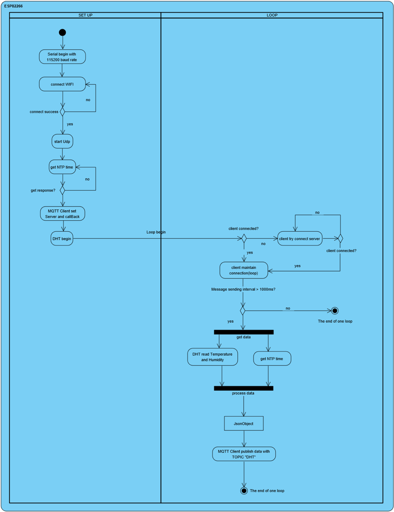

# ESP8266-MQTT-RaspberryPi
Use ESP8266MOD AI-THINKER as client sending data collected by DHT22 sensor to Raspberry pi.
And use Python Flask to dynamically display the received data in a web page.

P.S: I did this project in 2017 summer. The code was almost lost now. If I have time, I will do it again and try to upload it.

## To do this you will need:
* Raspberry Pi desktop setup
* One DHT22 sensor
* Some jumper
* Breadboard

## The process is below:
1.	Wire esp8266 with DHT22 sensor on breadboard
2.	Configure Raspbian
3.	Run server program on Raspbian
4.	Upload scratch to esp8266 using Arduino IDE
5.	Raspbian receive message from esp8266

## STEP 1: Connect a DHT22 sensor to ESP8266
In this section, use the breadboard and jumper wires to make the connection as follows.


For sensor pins, use following wiring:

| Sensor | ESP8266 | Cable |
| ------ | ------- | ----- |
| VCC(3.3-5v) | VCC(3V) | Blue |
| DATA | GPIO 2 | Red |
| GND | GND | Black |


## STEP 2: Configure and set up Raspberry pi
To configure the server environment: 
First, open the terminal and type
```linux
sudo apt-get update
```
Next, we will need to install a framework called Flask and two packages called flask-socketio and flask-bootstrap to create a website for displaying the data.
```linux
sudo pip install Flask
sudo pip install flask-socketio
sudo pip install flask-bootstrap
```
To communicate with esp8266, we still need another Flask extension called Flask-MQTT. (MQTT is a machine-to-machine "Internet of Things" protocol and was designed for extremely lightweight publish/subscribe messaging transport.) Simply install the package as usual via pip:
```linux
sudo pip install flask-mqtt
```

## STEP 3: Run server program
In this section, we will need to use Raspberry pi as a Broker.
The broker is primarily responsible for **receiving** all messages, **filtering** the messages, **decide** who is interested in it and then **publishing** the message to all subscribed clients.


Simply, the broker is like a delivery station. Mqtt client on Esp8266 is a publisher which send packages to the broker. Then the broker will transit those packages to the mqtt client(mqtt client on raspberry pi) who has subscribed this topic.

To configure and start the mosquito service. Open the file as follows:
```linux
sudo nano /etc/mosquito/mosquito.conf
```
You should see the following:

```linux
# Place your local configuration in /etc/mosquitto/conf.d/
#
# A full description of the configuration file is at
# /usr/share/doc/mosquitto/examples/mosquitto.conf.example

pid_file /var/run/mosquitto.pid

persistence true
persistence_location /var/lib/mosquitto/

log_dest file /var/log/mosquitto/mosquitto.log

include_dir /etc/mosquitto/conf.d

Change the "log_dest" line to:

log_dest topic
```
Next add six lines in the end:

```linux
log_type error
log_type warning
log_type notice
log_type information

connection_messages true
log_timestamp true
```

Now your /etc/mosquito.conf files should look like:
```linux
# Place your local configuration in /etc/mosquitto/conf.d/
#
# A full description of the configuration file is at
# /usr/share/doc/mosquitto/examples/mosquitto.conf.example

pid_file /var/run/mosquitto.pid

persistence true
persistence_location /var/lib/mosquitto/

log_dest topic

log_type error
log_type warning
log_type notice
log_type information

connection_messages true
log_timestamp true

include_dir /etc/mosquitto/conf.d
```
Now start the mosquito server:
```linux
sudo /etc/init.d/mosquito start
```
**Now the broker is already**

**Finally, run the server program which contains a mqtt client subscribing the special Topic and waiting for another mqtt client publish the message.**

**Set up mqtt server**
* MQTT_BROKER_URL: Broker address(your raspberry pi’s ip address)
* MQTT_BROKER_PORT: normally 1883
* MQTT_USERNAME and PASSWORD: set if you want

## STEP 3: Upload the scratch to ESP8266
1.	Wifi client connect to wifi
    1. WiFi_client.begin(ssid, password)
2.	Udp client for getting local time
    1. You can use other methods to get time.
3.	MQTT client connect to server(Broker address) and publish message
    1. mqtt_client.setServer(serverAddress, port)
    2. mqtt_client.setCallback(callback) callback is a function which can be write by you own
    3. mqtt_client.publish(Topic, message);

## UML diagram for integration of client and server:


## STEP 4: Raspberry pi receive the data and store it into database.
After the mqtt client on ESP8266 publishing the message, the mqtt client on Raspbian which has already subscribed the topic will receive the message. Then using socketio sending data to website which using bootstrap template to display and store the data into database using sqlite3 at same time.
